# Policy Copilot for Customer Care

Prototipo portfolio di un supporto operativo per team customer care. Non si
collega a Shopify, non legge caselle email e non esegue rimborsi: l’operatore
incolla una comunicazione, completa pochi controlli guidati e ottiene una
bozza motivata da regole aziendali esplicite.

Il prodotto dimostra un ciclo completo e verificabile:

```text
Workbench → Casi → Analytics → Policies
```

- **Workbench** crea e aggiorna il singolo caso;
- **Casi** conserva la memoria operativa con redazione degli identificatori più comuni;
- **Analytics** aggrega esclusivamente i dati salvati nei casi;
- **Policies** trasforma istruzioni grezze in documenti e regole revisionabili.

La regola progettuale è: **l’AI comprende, le regole decidono, l’operatore
approva.**

## Cosa si può provare

### 1. Workbench

Incolla una comunicazione del cliente. Il sistema:

1. rimuove email, telefono e riferimento dell’ordine prima di salvarla;
2. classifica il processo (recesso, garanzia, spedizione, pagamento e altri);
3. chiede un solo fatto operativo alla volta;
4. applica una regola deterministica;
5. prepara una risposta modificabile e copiabile;
6. chiede all’operatore di registrare l’esito realmente avvenuto.

Il prototipo non invia la risposta e non esegue azioni economiche.

### 2. Casi

È il database operativo del prodotto. Ogni record collega:

- conversazione con redazione automatica di email, telefoni e riferimenti d'ordine comuni;
- categoria e confidenza;
- fatti verificati dall’operatore;
- informazioni ancora mancanti;
- regola applicata e decisione proposta;
- risposta usata, modifiche ed esito reale;
- audit trail degli eventi.

Un dataset iniziale di otto casi sintetici viene creato una sola volta ed è
sempre marcato come **Dati demo**. I casi creati nel Workbench si aggiungono
alla stessa memoria.

### 3. Analytics

Non mostra KPI inventati. Calcola dai Casi:

- motivi di contatto più frequenti;
- esiti effettivi;
- informazioni richieste più spesso;
- tasso e motivi di modifica delle bozze;
- escalation e regole applicate;
- insight azionabili collegati ai record di origine.

Ogni suggerimento resta una proposta da valutare, non modifica
automaticamente prompt o policy.

### 4. Policies

Il Policy Builder accetta appunti liberi, TXT/MD, PDF, DOCX o un URL HTTPS.
La pipeline è:

```text
documento grezzo
→ estrazione strutturata
→ documento operativo ordinato
→ campi modificabili
→ conferma delle ambiguità
→ versione pubblicata in libreria
```

Le tre policy incluse nel codice alimentano il motore deterministico. Le nuove
versioni create dal wizard vengono salvate e versionate nella libreria, ma per
sicurezza non sostituiscono automaticamente le regole attive. Cinque scenari
permettono di simulare il motore senza store, azioni o nuovi casi.

## Architettura

```mermaid
flowchart LR
    Message[Messaggio operatore] --> Redaction[Redazione identificatori]
    Redaction --> Intent[Classificazione]
    Intent --> Facts[Controlli guidati]
    Facts --> Rules[Regole deterministiche]
    Rules --> Draft[Bozza]
    Draft --> Human[Revisione operatore]
    Human --> Cases[(Casi + audit)]
    Cases --> Analytics[Analytics interni]
    Analytics --> Policies[Segnali per le policy]
```



- Flask serve UI e API;
- SQLite conserva casi, messaggi, audit, feedback e policy pubblicate;
- HTML/CSS/JavaScript non richiedono un frontend framework;
- il nuovo percorso principale non richiede Shopify o chiavi AI;
- la precedente demo Shopify/Sendcloud/Make resta disponibile come scenario
  portfolio separato e completamente mock.

## Avvio locale

```powershell
python -m venv venv
.\venv\Scripts\Activate.ps1
pip install -r requirements.txt
python app.py
```

Apri `http://127.0.0.1:5000/workbench`.

Le sezioni principali sono:

- `/workbench`
- `/cases`
- `/analytics`
- `/policies`

Le vecchie dimostrazioni end-to-end restano in `/demo/doa` e
`/demo/recesso`; `/database` è mantenuto come alias compatibile del registro.

## Configurazione

Il percorso principale funziona senza variabili segrete. Sono opzionali:

- `DATABASE_PATH`: percorso del database SQLite, default `data/returns.db`;
- `DEMO_MODE=true`: abilita gli scenari portfolio precedenti;
- `RETURN_SHIPPING_PROVIDER=mock`: mantiene la spedizione in simulazione;
- `ANTHROPIC_API_KEY`, `SHOPIFY_STORE`, `SHOPIFY_TOKEN`: usate soltanto dal
  precedente esperimento integrato, non dalle quattro sezioni principali.

Non inserire credenziali o dati cliente reali nel prototipo pubblico.

## Test

```powershell
python -m unittest discover -s tests -v
```

I 45 test coprono il nuovo ciclo Workbench–Casi–Analytics–Policies, redazione
degli identificatori, decisioni deterministiche, persistenza, versionamento,
state machine, simulazioni e compatibilità con i workflow portfolio esistenti.

## Deploy su Render

`render.yaml` configura un Web Service Flask con Gunicorn:

```text
Build: pip install -r requirements.txt
Start: gunicorn --bind 0.0.0.0:$PORT app:app
```

Il piano demo usa `/tmp/customer-return-agent.db`: il database è effimero e
può essere ricreato quando l’istanza viene sostituita. Per una futura versione
multiutente servirebbero autenticazione, PostgreSQL, backup, ruoli e una
politica formale di retention.

## Limiti dichiarati

- nessuna autenticazione o separazione tra organizzazioni;
- redazione automatica limitata agli identificatori più comuni: l’operatore
  deve comunque evitare dati sensibili;
- nessun invio email, upload allegati o integrazione helpdesk;
- le nuove policy pubblicate non vengono attivate automaticamente;
- classificazione locale dimostrativa, non un modello addestrato;
- SQLite e filesystem effimero sono adatti a un portfolio, non a produzione.

Academy e Radar sono volutamente fuori da questa iterazione: verranno aggiunti
solo dopo aver validato le quattro sezioni centrali.
