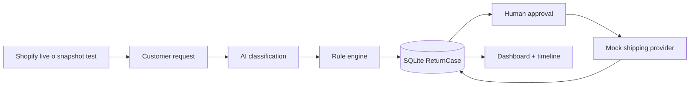

# Customer Return Agent

Prototipo portfolio di Return Operations per Shopify. Riceve una richiesta
cliente, usa l'AI per strutturarla, applica regole deterministiche, crea una
pratica persistente e richiede l'approvazione dell'operatore prima di produrre
un'etichetta di reso mock.

Il progetto è un prototipo demo-safe: non emette rimborsi, non modifica ordini
o inventario e non chiama Sendcloud reale. La modalità portfolio include sei
scenari guidati che funzionano anche senza credenziali Shopify o Anthropic.

## Cosa dimostra

- intake conversazionale e memoria dei messaggi per pratica;
- recupero dei dati ordine tramite Shopify Admin API;
- separazione tra estrazione AI e decisioni deterministiche;
- approvazione umana e checkpoint fisico in magazzino;
- state machine, audit trail e database operativo SQLite;
- esecuzione pubblica sicura tramite snapshot anonimizzati dello store test.

## Architecture



- **LLM:** comprende il testo e genera la bozza;
- **Rule engine:** decide secondo `policies.md`;
- **Human:** approva, modifica o escala;
- **SQLite:** mantiene pratica, stato, metriche e timeline;
- **Mock provider:** simula return ID, tracking ed etichetta.

L'audit tecnico dettagliato è in
[`docs/return-agent-architecture.md`](docs/return-agent-architecture.md).

## Tech stack

- Python 3.12 e Flask;
- SQLite tramite `sqlite3`, senza ORM;
- Anthropic API per classificazione e testo;
- Shopify Admin API collegata allo store di test;
- HTML/CSS/JavaScript senza framework frontend.

## Setup

```powershell
python -m venv venv
.\venv\Scripts\Activate.ps1
pip install -r requirements.txt
Copy-Item .env.example .env
python app.py
```

Aprire `http://127.0.0.1:5000`.

Senza chiavi API landing, dashboard, Workbench, Policies, Database e Analytics
restano utilizzabili. Il simulatore cliente continua le pratiche registrate
senza chiamate a pagamento; l'intake di un nuovo ordine richiede invece Shopify
e Claude live.

## Sezioni del prototipo

- `/`: landing portfolio e percorso di verifica;
- `/dashboard`: panoramica operativa e coda prioritaria;
- `/workbench`: conversazione, bozza AI, revisione umana e feedback;
- `/policies`: regole applicate, eccezioni e flusso decisionale;
- `/database`: pratiche persistenti, memoria conversazionale e stato;
- `/analytics`: metriche calcolate da pratiche, audit e feedback.

## Environment variables

- `ANTHROPIC_API_KEY`: chiave API per classificazione e bozza;
- `SHOPIFY_STORE`: dominio dello store Shopify di test;
- `SHOPIFY_TOKEN`: token Shopify; la dashboard legge gli ordini. Lo script
  opzionale di popolamento richiede anche scrittura clienti/ordini;
- `DEMO_MODE`: `true` abilita gli scenari portfolio riproducibili;
- `RETURN_SHIPPING_PROVIDER`: deve restare `mock` nel prototipo;
- `DATABASE_PATH`: percorso SQLite facoltativo, default `data/returns.db`.

Non usare credenziali o dati di produzione.

## Portfolio demo verificabile

La sezione **Guided demo** prepara sei casi con stati differenti: recesso nei
termini, DOA con richiesta prove, prodotto igienico aperto, controllo di
magazzino, escalation e rimborso completato. I record derivano dal manifest
`data/shopify_experiment_return-agent-20260901.json`, prodotto durante il seed
del vero store Shopify test.

Nel dettaglio pratica sono visibili:

- origine e modalità del dato (`live_api` oppure `recorded_fixture`);
- Shopify order ID e timestamp di acquisizione;
- payload Shopify ridotto e anonimizzato;
- risultato atteso dello scenario e risultato del motore;
- policy applicata, modalità AI, conversazione e audit trail.

**Ripristina demo** elimina e ricrea soltanto le sei pratiche portfolio; le
pratiche inserite manualmente non vengono toccate.

## Mock mode e dati demo

Il provider spedizioni è sempre mock. Dopo l'approvazione crea identificativi
`MOCK-RET-*`, tracking `MOCK*` e un URL simbolico, senza traffico esterno.

Per popolare un database vuoto:

```powershell
python scripts/seed_demo.py
```

Per preparare su Shopify 20 clienti sintetici e 20 ordini test, prima eseguire
il controllo senza modifiche e poi il caricamento esplicito:

```powershell
python scripts/seed_shopify_experiment.py --allow-store mindroute.myshopify.com
python scripts/seed_shopify_experiment.py --execute --allow-store mindroute.myshopify.com
```

Servono `read/write_customers` e `read/write_orders`. Gli ordini hanno
`test=true`, pagamento in attesa e notifiche disabilitate; lo script non crea
transazioni o spedizioni. Al termine genera in `data/` una guida con i messaggi
cliente già pronti da copiare nella dashboard.

## Demo workflow

1. Aprire la dashboard e scegliere una pratica nella coda prioritaria.
2. Nel Workbench leggere soltanto i messaggi già inviati a sinistra.
3. Controllare a destra contesto Shopify, confidence, policy e bozza.
4. Approvare, modificare, rigenerare con feedback oppure escalare.
5. Usare il simulatore cliente per continuare il botta e risposta.
6. Per un reso eleggibile viene creata l'etichetta mock.
7. Segnare il pacco in transito e ricevuto; il rimborso resta bloccato fino
   al controllo fisico esplicito dell'operatore.
8. Consultare Database, timeline e Analytics per verificare ciò che è stato
   salvato.

La sezione **Database resi** (`/database`) mostra il registro SQLite completo
in forma tabellare. Ogni e-mail o messaggio aggiunto alla pratica viene salvato
in `case_messages`; una nuova risposta sullo stesso ordine aggiorna la pratica
esistente invece di crearne automaticamente una duplicata.

Le prove foto/video sono considerate ricevute soltanto quando l'operatore usa
il comando esplicito nella pratica. Per rasoi e spazzolini viene chiesto lo
stato del sigillo prima di decidere.

## ReturnCase state machine

Le transizioni sono definite in `src/domain.py`. Il percorso principale è:

```text
NEW → ANALYZED → WAITING_HUMAN_APPROVAL → APPROVED
    → LABEL_CREATED → WAITING_FOR_RETURN → RETURN_RECEIVED
    → RETURN_VALIDATED → REFUND_PENDING/REPLACEMENT_PENDING
    → REFUNDED/REPLACED → CLOSED
```

`RETURN_RECEIVED` significa soltanto **arrivato e da controllare**. Rimborso e
swap restano bloccati finché un operatore non conferma il controllo fisico e
porta la pratica a `RETURN_VALIDATED`.

Sono previsti anche `NEEDS_INFORMATION`, `REJECTED` ed `ESCALATED`. Ogni
transizione produce un evento in `audit_events`.

## Policies architecture

`policies.md` resta la fonte leggibile. `return_policies.json` ne espone i
parametri applicabili al codice e `src/rules.py` è l'unico motore decisionale,
usato sia dall'intake live sia dagli scenari portfolio. Ogni pratica salva
versione, regola, sezioni e vincoli applicati in `policy_decision`.

Sono operative anche le scadenze a 15 giorni, la scelta rimborso/swap per DOA,
il controllo del sigillo, il pagatore della spedizione, la verifica fisica e il
fallback a rimborso quando manca lo stock sostitutivo. Le voci marcate
`[DA CONFERMARE]` non vengono inventate: compaiono in dashboard e richiedono
una decisione umana.

## API integrations

- Shopify: lettura dell'ordine di test durante il workflow; scrittura usata
  soltanto dallo script demo lanciato esplicitamente;
- tracking: `deliveries.json` è il mock corrente;
- spedizione reso: `MockReturnShippingProvider`;
- Sendcloud reale: non implementato finché non esiste un ambiente test
  esplicitamente autorizzato.

## Testing

I test non richiedono API o credenziali:

```powershell
python -m unittest discover -s tests -v
```

I 30 test coprono regole, sigillo, prove, confidence, scadenze, persistenza,
scenari portfolio, pagine separate, feedback, conversazione simulata,
transizioni, ispezione e workflow completo con etichetta mock.

## Deploy portfolio su Render

Il file `render.yaml` avvia l'app con Gunicorn, database effimero e modalità
demo. Non sono necessarie chiavi API per la demo guidata. A ogni nuova istanza
gli scenari vengono ricreati dal manifest versionato; `/health` espone soltanto
lo stato tecnico non sensibile.

## Current limitations

- applicazione locale senza autenticazione o ruoli;
- un solo prodotto principale salvato per pratica; gli ordini multiprodotto
  richiedono ancora un modello line-item più completo;
- nessun upload reale di foto/video;
- nessun invio reale della risposta al cliente;
- sul piano Shopify Basic nome ed e-mail sono oscurati all'API; per gli ordini
  sintetici la dashboard usa esclusivamente i dati demo salvati nel manifest;
- Shopify REST dovrà essere migrato a GraphQL;
- SQLite e processo Flask singolo sono adatti alla demo, non alla produzione;
- il return rate non è calcolabile senza il totale degli ordini venduti.

## Future improvements

Prima di un uso reale: autenticazione operatori, PostgreSQL, gestione completa
dei line item, storage allegati, Sendcloud sandbox, canale email/helpdesk,
GraphQL Shopify e policy aziendali definitive.
