# Ops Copilot

Portfolio prototype di un copilot per workflow operativi guidati da procedure.
Trasforma una richiesta non strutturata in un caso, raccoglie il contesto
mancante, applica un playbook deterministico e prepara la prossima azione per
la revisione umana.

Non è legato a Shopify e non è un chatbot generico. Il suo perimetro è:

```text
Richiesta → Contesto → Playbook → Proposta → Human gate → Esito → Insight
```

Il prototipo funziona senza collegare caselle email, CRM, store o strumenti
aziendali e non esegue azioni esterne.

## Quattro sezioni, una memoria

- **Workbench** crea e aggiorna i casi operativi;
- **Casi** conserva richiesta, fatti, decisione, feedback ed esito;
- **Analytics** aggrega esclusivamente i dati salvati nei casi;
- **Playbooks** organizza policy, SOP e procedure in regole revisionabili.

## Workflow inclusi

Il motore è orizzontale, ma viene dimostrato attraverso tre template verticali.

### Customer care

Classifica e gestisce recesso, garanzia, danni, articoli errati, spedizioni,
pagamenti, informazioni prodotto e reclami. Può preparare una risposta da
revisionare e registrare esiti come rimborso, sostituzione o escalation.

### Agenzia & delivery

Gestisce nuovi progetti, cambi di scope, approvazioni e blocchi di delivery.
Verifica brief, scadenza, budget, impatto e responsabilità; produce una risposta,
un brief o il prossimo handoff operativo.

### Operations interne

Gestisce richieste di acquisto, accessi, incidenti ed eccezioni di processo.
Verifica motivazione, approvazione, priorità, impatto e owner; propone
assegnazione, escalation o avvio del processo.

## Workbench

L’operatore seleziona il workflow e incolla una richiesta, un’email o una nota.
Il sistema:

1. rimuove email, telefono e riferimenti comuni prima del salvataggio;
2. classifica il tipo di richiesta all’interno del workflow scelto;
3. chiede un solo fatto operativo alla volta;
4. applica una regola deterministica del playbook;
5. prepara un output modificabile e copiabile;
6. richiede all’operatore di registrare l’esito realmente avvenuto.

La classificazione e la redazione sono dimostrative e locali. Non viene
effettuato alcun invio o aggiornamento esterno.

## Casi e Analytics

Ogni caso collega:

- workflow e tipo di richiesta;
- testo con redazione base;
- fatti verificati e informazioni mancanti;
- regola applicata e motivazione;
- output usato, modifiche ed esito;
- audit trail degli eventi.

Un dataset di 12 casi sintetici, distribuiti sui tre workflow, viene creato in
modo idempotente ed è sempre marcato come demo. Analytics calcola dai casi:

- utilizzo per workflow;
- tipi di richiesta più frequenti;
- esiti reali;
- informazioni richieste più spesso;
- modifiche alle proposte;
- escalation e regole applicate;
- suggerimenti da valutare nei Playbooks.

## Playbook Builder

Accetta appunti liberi, TXT/MD, PDF, DOCX o un URL HTTPS. Distingue procedure
customer care, agency delivery e operations interne, poi produce una bozza
strutturata:

```text
documento grezzo
→ estrazione di regole, responsabilità ed eccezioni
→ documento operativo ordinato
→ valori modificabili
→ conferma delle ambiguità
→ versione pubblicata in libreria
```

I tre playbook inclusi nel codice alimentano il motore. Le versioni create dal
builder vengono salvate e versionate, ma non sostituiscono automaticamente le
regole attive.

## Architettura

```mermaid
flowchart LR
    Request[Richiesta] --> Workflow[Workflow selezionato]
    Workflow --> Redaction[Redazione identificatori]
    Redaction --> Intent[Classificazione]
    Intent --> Facts[Controlli guidati]
    Facts --> Playbook[Regole deterministiche]
    Playbook --> Proposal[Proposta operativa]
    Proposal --> Human[Revisione umana]
    Human --> Cases[(Casi + audit)]
    Cases --> Analytics[Analytics interni]
    Analytics --> Playbooks[Segnali per i playbook]
```



- Flask serve UI e API;
- SQLite conserva casi, messaggi, audit, feedback e playbook pubblicati;
- HTML, CSS e JavaScript non richiedono un frontend framework;
- il percorso principale non richiede chiavi AI o integrazioni;
- la demo Shopify/Sendcloud/Make rimane un caso verticale separato e mock.

## Avvio locale

```powershell
python -m venv venv
.\venv\Scripts\Activate.ps1
pip install -r requirements.txt
python app.py
```

Apri `http://127.0.0.1:5000/workbench`.

Sezioni principali:

- `/workbench`
- `/cases`
- `/analytics`
- `/playbooks`

Gli endpoint `/policies` e `/database` rimangono come alias compatibili. Le
demo resi approfondite sono disponibili in `/demo/doa` e `/demo/recesso`.

## Configurazione

Il percorso principale funziona senza variabili segrete. Sono opzionali:

- `DATABASE_PATH`: percorso del database SQLite, default `data/returns.db`;
- `DEMO_MODE=true`: abilita gli scenari portfolio precedenti;
- `RETURN_SHIPPING_PROVIDER=mock`: mantiene le spedizioni in simulazione;
- `ANTHROPIC_API_KEY`, `SHOPIFY_STORE`, `SHOPIFY_TOKEN`: usate soltanto dal
  precedente esperimento integrato.

Non inserire credenziali o dati personali reali nel prototipo pubblico.

## Test

```powershell
python -m unittest discover -s tests -v
```

La suite copre i tre workflow, il ciclo Workbench–Casi–Analytics–Playbooks,
redazione, decisioni deterministiche, persistenza, versionamento, state
machine, simulazioni e compatibilità con le demo resi esistenti.

## Deploy su Render

`render.yaml` configura un Web Service Flask con Gunicorn:

```text
Build: pip install -r requirements.txt
Start: gunicorn --bind 0.0.0.0:$PORT app:app
```

Il piano demo usa un database effimero. Una versione multi-tenant richiederebbe
autenticazione, PostgreSQL, backup, ruoli e una politica formale di retention.

## Limiti dichiarati

- tre workflow preconfigurati, non ancora un builder universale di workflow;
- nessuna autenticazione o separazione tra organizzazioni;
- redazione limitata agli identificatori più comuni;
- nessun invio, upload di allegati o integrazione con strumenti esterni;
- i nuovi playbook pubblicati non vengono attivati automaticamente;
- classificazione locale dimostrativa, non un modello addestrato;
- SQLite e filesystem effimero sono adatti al portfolio, non alla produzione.

Academy e Radar restano volutamente fuori da questa iterazione.
