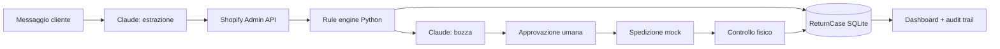

# Return Agent — architettura del prototipo

## Flusso operativo



Responsabilità separate:

- **Claude** struttura il linguaggio naturale e prepara il testo;
- **Shopify** è la fonte dei dati di ordine, cliente e prodotto;
- **Rule engine** decide l'idoneità secondo `policies.md`;
- **Operatore** approva il messaggio e valida fisicamente il reso;
- **SQLite** conserva pratica, conversazione, stato e audit trail;
- **Mock shipping provider** simula etichetta e tracking senza azioni esterne.

## Modalità portfolio

La dashboard può essere aperta senza credenziali. Sei scenari riproducibili
usano il manifest creato durante l'esperimento sullo store Shopify test:

`data/shopify_experiment_return-agent-20260901.json`

Ogni pratica registra:

- `data_source`: sistema sorgente dichiarato;
- `source_mode`: `live_api` oppure `recorded_fixture`;
- `source_fetched_at`: momento di acquisizione;
- `source_payload`: snapshot ridotto e privo di credenziali;
- `ai_mode`: elaborazione Claude live oppure risultato demo registrato;
- `scenario_slug`: scenario portfolio, se presente.
- `policy_decision`: versione, regola, sezioni e vincoli realmente applicati.

Il dettaglio pratica espone questi campi, il risultato atteso e la timeline.
In questo modo il visitatore può verificare la provenienza dei dati senza
accedere allo store privato.

## State machine

```text
NEW → ANALYZED → WAITING_HUMAN_APPROVAL → APPROVED
    → LABEL_CREATED → WAITING_FOR_RETURN → RETURN_RECEIVED
    → RETURN_VALIDATED → REFUND_PENDING/REPLACEMENT_PENDING
    → REFUNDED/REPLACED → CLOSED
```

Sono previsti anche `NEEDS_INFORMATION`, `REJECTED`, `RETURN_IN_TRANSIT` ed
`ESCALATED`. Le transizioni non previste vengono rifiutate lato server.

`RETURN_RECEIVED` significa soltanto che il tracking o l'operatore hanno
registrato l'arrivo. Rimborso e sostituzione rimangono bloccati fino alla
transizione manuale `RETURN_VALIDATED`.

## Scelte intenzionalmente semplici

- Flask con template server-side e JavaScript minimo;
- SQLite senza ORM;
- CSS proprietario senza framework frontend;
- snapshot versionato per la demo pubblica;
- nessuna azione economica o modifica Shopify;
- nessun account o ruolo, perché non necessari per il portfolio.

## Verifica

La suite contiene 28 test automatici per regole, confidence, scadenze,
persistenza, memoria conversazionale, reset selettivo degli scenari, ispezione
fisica e workflow completo.

```powershell
python -m unittest discover -s tests -v
```

Per un'eventuale evoluzione produttiva servirebbero autenticazione, storage
allegati, PostgreSQL, Shopify GraphQL, email/helpdesk e provider logistico reale.
